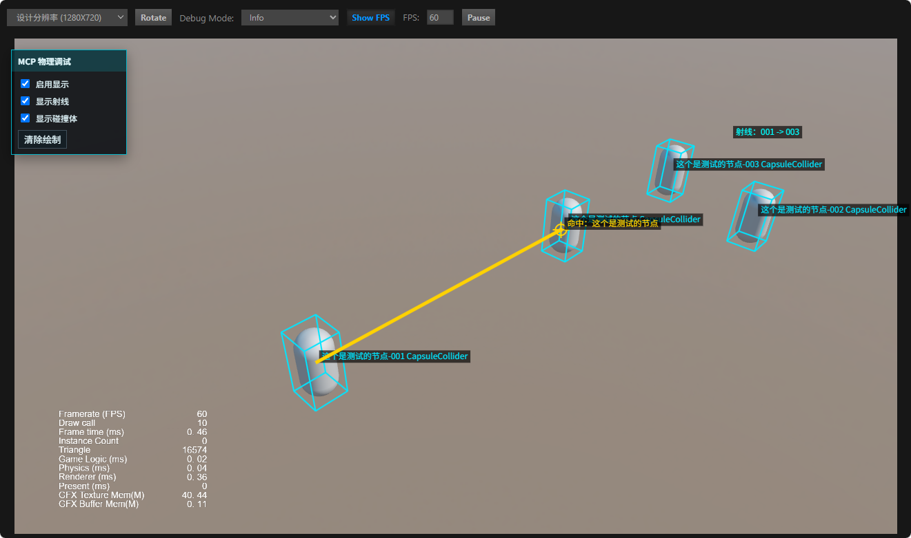

# Cocos MCP Server

Cocos MCP Server 是一个面向 Cocos Creator 3.7+ / 3.8.x 的 MCP 插件，让支持 MCP 的 AI 客户端可以读取和操作 Cocos 工程、场景、节点、组件、资源、动画和预览运行态。

插件提供编辑器面板、MCP 服务启动入口、工具管理和运行可视化能力，适合用 AI 辅助完成 UI 搭建、节点编辑、资源查询、动画配置、场景检查和浏览器预览调试。

## 主要能力

- 在 Cocos Creator 内启动 MCP Server，并把编辑器能力暴露给 AI 客户端。
- 通过工具管理面板查看、启用和配置已注册工具。
- 支持场景、节点、组件、预制体、资源、编辑器、视图、UI 模板、构建、动画等常用工作流。
- 支持浏览器预览状态查询和运行态桥接，便于 AI 理解预览页面里的实际节点树。
- 支持 Animation Mask 和 Animation Graph 等 Cocos Creator 3.8.x 动画资源编辑。

## 安装

1. 将 `cocos-mcp-server` 文件夹放入 Cocos Creator 项目的 `extensions/` 目录。
2. 打开或重启 Cocos Creator。
3. 在顶部菜单中打开 MCP Server 面板。
4. 启动 MCP 服务，并按面板生成的配置接入 Claude、Cursor、Codex 等 MCP 客户端。

更多安装说明见 [INSTALL.md](./INSTALL.md)。

## 24 个工具简表

| 工具 | 功能简介 |
| --- | --- |
| `scene` | 场景管理工具，用于打开、保存、创建、关闭场景，读取层级和快照，查询场景状态，执行撤销事务，执行编辑器方法或脚本，检测场景引用、组件类型和脚本类。 |
| `node` | 节点工具，用于查找、创建、修改、移动、排序、复制、粘贴、剪切、删除节点，设置 Transform、尺寸、锚点和激活状态，挂载或移除脚本，并支持批量修改。 |
| `component` | 组件工具，用于添加、移除、查看和配置组件属性，查询可用组件类型，绑定按钮、滑块、开关事件，并支持批量点击事件绑定。 |
| `prefab` | 预制体工具，用于列出、检查、校验、创建、实例化、删除、解绑、进入编辑、保存编辑、退出编辑、应用或回退预制体变更。 |
| `asset` | 资源工具，用于搜索、查询详情、创建、保存、复制、移动、删除、导入、批量导入、刷新、重新导入资源，查询依赖、清单和资源就绪状态，并在 UUID、路径和 URL 之间转换。 |
| `editor` | 编辑器工具，用于读取项目信息和项目设置，运行、停止或查询预览，构建项目，打开构建面板，读取控制台和日志，管理偏好设置，查询服务器网络信息并重载编辑器。 |
| `view` | 视图工具，用于切换 Gizmo 工具、坐标系、轴心、2D/3D 模式、网格、图标显示，聚焦节点，对齐相机，并添加、切换、定位、缩放、设置透明度或清理参考图。 |
| `composite` | 复合 UI 工具，用于一次调用创建按钮、文本、图片和内置 UI 控件，也可挂载脚本并完成属性绑定，支持 Widget 对齐和批量生成 UI 元素。 |
| `knowledge` | 知识查询工具，用于查询 Cocos 组件属性、UI 规则、布局模式、Widget 策略、节点结构、动画配方、最佳实践和工具使用指南。 |
| `validate` | 深度校验工具，用于检查 UI 重叠、越界、资源引用一致性、层级深度和命名问题，适合在 AI 批量改场景后做质量检查。 |
| `template` | UI 模板工具，用于列出并应用内置模板，例如弹窗、滚动列表、导航栏和设置页。 |
| `capture` | 场景快照工具，用于导出场景或指定节点子树的结构化 JSON，帮助 AI 理解布局、尺寸、位置、组件、文本和渲染信息。 |
| `builder` | JSON 构建工具，用于根据声明式节点树一次性创建复杂层级和组件，适合批量生成 UI、原型结构或多层节点树。 |
| `animation` | 动画工具，用于播放控制、创建和编辑动画剪辑、轨道、关键帧、曲线、事件、预设和批量动画操作，也支持文件写入模式。 |
| `spine` | Spine 工具，用于读取 `sp.Skeleton` 动画和皮肤，设置动画、皮肤、属性、骨骼数据和 socket。 |
| `label` | 文本工具，用于管理 `cc.Label`、`cc.RichText`、`cc.EditBox` 的文本、字体、字号、颜色、对齐、溢出、描边、阴影和批量样式。 |
| `physics` | 物理配置工具，用于检查和配置刚体、碰撞体、触发区、投射物碰撞、碰撞分组、碰撞掩码、物理材质和物理调试；运行态支持射线、区域和碰撞体可视化。 |
| `material` | 材质与 Shader 工具，用于列出、创建、检查材质和 effect，设置材质属性、颜色、贴图和 define，检查 Renderer 材质槽，分配、清空、替换材质，查找使用处并校验材质引用。 |
| `shader_debug` | Shader Debug Lab 工具，用于自动创建/检查内置材质测试场景，对单个或批量材质生成截图、debug JSON、contact sheet 和 HTML 报告，方便 AI 自检 shader 渲染结果。 |
| `vfx` | VFX/粒子效果工具，用于列出场景和资源中的特效，检查、创建、实例化、编辑、绑定资源、删除和校验粒子、拖尾、线条、公告板等常见特效节点。 |
| `animation_mask` | Animation Mask 工具，用于创建、查询、更新 `.animask` 资源，设置、批量设置、移除和清空骨骼遮罩，检查骨骼来源，校验并规范化骨骼路径。 |
| `animation_graph` | Animation Graph 工具，用于编辑 `.animgraph` 资源，管理参数、状态、动画状态、连线、过渡条件、Layer、速度、权重、遮罩，并校验动画图兼容性。 |
| `preview` | 浏览器预览工具，用于启动、停止和查询预览状态，返回预览地址、端口、启动时间和服务复用情况。 |
| `runtime` | 运行态桥接工具，用于在浏览器预览页中读取运行时场景树、节点、组件、Renderer、材质、控制台日志和帧统计信息，并支持修改节点激活、Transform 和调用组件方法。 |

## 功能图文介绍

### 运行态物理调试可视化

`cocos_physics` 支持在 Cocos Web 预览运行后绘制物理调试信息，AI 可以通过 MCP 在外部浏览器自动打开注入预览页，并把射线、命中点和碰撞体线框直接叠加到游戏画面上。



这个功能主要用于排查 3D 游戏里的物理检测问题，例如射线是否从正确位置发出、是否被中间碰撞体遮挡、命中的具体节点是谁，以及运行态碰撞体和模型显示是否对齐。调试面板支持开启或关闭显示、单独控制射线和碰撞体显示，并可以清除或恢复当前绘制内容。

常用能力包括：

- `debug_draw_ray`：绘制运行态射线，可显示命中点和命中节点名称。
- `debug_draw_collider`：绘制指定节点的碰撞体线框。
- `debug_draw_all_colliders`：绘制当前运行场景中的全部碰撞体。
- `debug_set_visibility`：控制物理调试面板、射线和碰撞体显示状态。
- `debug_clear_drawings`：清除当前运行态调试绘制。

射线调试推荐流程：

1. 使用 `cocos_runtime.open_injected_preview` 打开外部浏览器自动注入预览页。
2. 使用 `cocos_runtime.wait_until_ready` 等待运行态场景就绪。
3. 使用 `cocos_physics.debug_set_visibility` 打开物理调试面板。
4. 使用 `cocos_physics.debug_draw_all_colliders` 绘制场景碰撞体线框。
5. 使用 `cocos_physics.debug_draw_ray` 绘制射线并检查命中结果。

移动中的节点建议给 `debug_draw_ray` 传 `live: true`，这样射线每帧会重新采样起点、目标点和命中点。按节点绘制时优先使用 `originNode` 和 `targetNode`，工具会优先使用节点碰撞体中心；如果命中物体，返回结果会包含 `hitInfo.result.node`、`hitInfo.result.collider`、`hitInfo.result.point` 和 `hitInfo.result.distance`，画面中也会显示“命中：节点名”。

示例：

```json
{
  "action": "debug_draw_ray",
  "originNode": "这个是测试的节点-001",
  "targetNode": "这个是测试的节点-003",
  "live": true,
  "raycast": true,
  "maxDistance": 20,
  "label": "射线：001 -> 003",
  "showLabel": true
}
```

## 使用建议

- 修改 3 个以上节点时优先使用 `node` 的 `batch_modify`。
- 批量绑定按钮点击事件时优先使用 `component` 的 `batch_click_event`。
- 构建复杂 UI 层级时优先使用 `builder`，简单按钮、文本、图片可用 `composite`。
- 检查断裂资源引用可用 `scene.validate_scene`，做布局和层级深度检查可用 `validate`。
- 不熟悉某个工具 action 时，可先用 `knowledge` 查询 `tool_guide`。

## v1.7.8 Update

- Added packaged `cocos_shader_debug` lab workflow: `setup`, `capture`, `suite`/`validate_suite`, and `smoke_test`.
- The shader debug lab auto-ensures `db://assets/mcp_shader_debug` from the bundled template and keeps captures/reports in `assets/mcp_shader_debug/captures`.
- Batch validation now writes PNG captures, per-material debug JSON, summary JSON, striped-border contact sheet PNG, and HTML report.
- Tool schema descriptions now document the recommended automation flow and failure fields: `diagnostics`, `visualCheck`, `materialInspection`, `camera`, `targets`, `imagePath`, and `debugPath`.
- Editor restart entries now only use the Cocos Dashboard/editor restart IPC. External PowerShell/direct CocosCreator fallback has been removed.

## v1.7.7 更新内容

- 增强 `cocos_runtime` 运行态桥接，新增按组件查找运行时节点、读取属性路径、调用组件方法和等待运行时控制台日志等能力。
- 优化运行态日志读取，支持按 `sinceIndex`、关键字、日志级别和等待时间获取浏览器预览页日志，便于验证运行后效果。
- 增加运行态私有属性路径保护，默认阻止读取 `_` 开头的私有属性路径。
- 优化 Codex stdio 桥接默认 MCP 地址，默认指向 `http://127.0.0.1:3300/mcp`，降低端口配置缺失时的连接失败概率。
- 已验证 `bridgeVersion 0.1.4` 在 Cocos 浏览器预览页中可正常完成场景 ready、组件查找、属性读取、方法调用和日志回读。

## v1.7.6 更新内容

- 新增 Cocos Web 运行态桥接能力，支持通过浏览器预览页读取运行时场景树、节点、组件和基础统计信息。
- 新增 `cocos_runtime` 工具，支持检查运行态连接、等待场景就绪、查找节点、读取节点信息、读取组件信息、切换节点显隐和修改 Transform。
- 新增运行态代理注入页，可通过 `injectedPreviewUrl` 自动注入 runtime bridge，减少手动在浏览器控制台执行脚本的步骤。
- 优化 runtime bridge 客户端管理，清理旧客户端并拒绝过旧 bridge 版本，避免旧页面干扰 active client 选择。
- 修复预览代理下场景 JSON、socket.io、WASM 和 engine external 资源转发问题，提升 Cocos 预览页运行态读取稳定性。
- 优化启动 MCP 服务器面板，支持端口配置、启动/停止、重启 Cocos 后自动启动、工具列表查看、MCP 地址获取、插件重新加载和版本信息展示。

## 联系

如需支持或定制，可联系：

- QQ: 1799096798
- 微信: 13272695146
